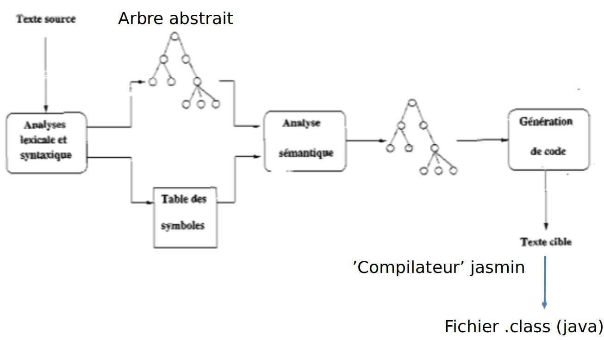
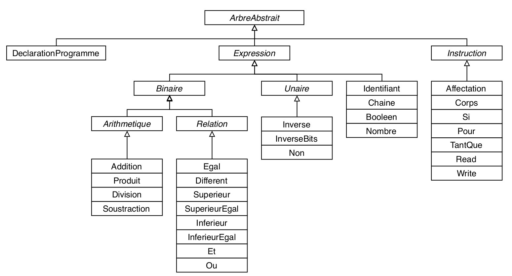

# HepialCompiler

**Réalisé par :** Quentin Leblanc, Justin Foltz

**Date :** 06.2019

## Le projet

Ce projet consiste à implémenter un compilateur d'un langage simplifié : Hepial.

## Pré-requis :

Le paquet *jflex* est nécessaire pour faire fonctionner ce compilateur.

## Lancement du compilateur

Le programme peut être lancé avec la commande suivante : 

```bash
make
```

Dans ce cas le compilateur utilisera le fichier source *test.hepial* et générera le fichier bytecode *demo.class*.

Le fichier *test.hepial* fourni permet de lister les différents programmes implémentés :

* *pyramide.hepial* : affiche une pyramide de ''*'' dont la taille dépend du nombre saisi par l'utilisateur.
* *game.hepial* : jeu où l'utilisateur doit trouver un nombre en 5 tentatives avec comme indications "trop grand" ou "trop petit";
* *erreurs.hepial* : programme contenant des erreurs. La localisation et la cause des erreurs sont spécifiées par le compilateur.

Pour charger un programme ou modifier le fichier de sortie, il est possible de lancer le programme avec les arguments suivants :

```bash
make hepial FILEIN=<src> FILEOUT=<dst>
```

La commande ci-dessous permet de supprimer les programmes précedement générés :

```bash
make clean
```


## Fonctionnement



* *FLEX* : permet d'identifier les éléments du langage dans le programme source
* *CUP* : vérifie que la syntaxe des éléments envoyés par *FLEX* respecte les règles de grammaire spécifiques au langage *Hepial*;
* *JAVA* : analyse sémantique du programme source grâce à la lecture d'un arbre construit pendant la réduction des règles de *CUP*. Génère un programme *JASMIN* durant la lecture de l'arbre;
* *JASMIN* : génère l'image finale à partir du programme précédemment construit.

## Arbre abstrait

